## 목차

1. [프로젝트 개요](#1-프로젝트-개요)
2. [프로젝트 목표 및 기대 결과](#2-프로젝트-목표-및-기대-결과)
3. [v0.5 주요 변경사항](#3-v05-주요-변경사항)
4. [LLM 대화 메모리 이해하기](#4-llm-대화-메모리-이해하기)
5. [메모리 구현 접근 방법](#5-메모리-구현-접근-방법)
6. [진행 방식 및 일정 (2주)](#6-진행-방식-및-일정-2주)
7. [수행 방향성 및 접근 방법](#7-수행-방향성-및-접근-방법)
8. [참고 자료](#8-참고-자료)

---

## 1. 프로젝트 개요

### 1.1 배경

**Envoy AI Gateway v0.5**로 버전업하고, 이를 활용하여 **LLM 대화 메모리 기능**을 구현합니다.

> ⚠️ **중요한 사실**
>
> Envoy AI Gateway는 **대화 메모리 기능을 내장하고 있지 않습니다.**
>
> → v0.5의 확장 기능을 활용해 **직접 구현**해야 합니다.

### 1.2 프로젝트 범위

| 구분 | 내용 |
|------|------|
| **Core** | v0.4 → v0.5 마이그레이션, LLM 대화 메모리 PoC 구현 |
| **Option** | MCP 세션 메모리 (AI Agent 도구 연동용) |
| **Out of Scope** | 프로덕션 배포, 전체 서비스 마이그레이션 |

---

## 2. 프로젝트 목표 및 기대 결과

### 2.1 구체적인 목표

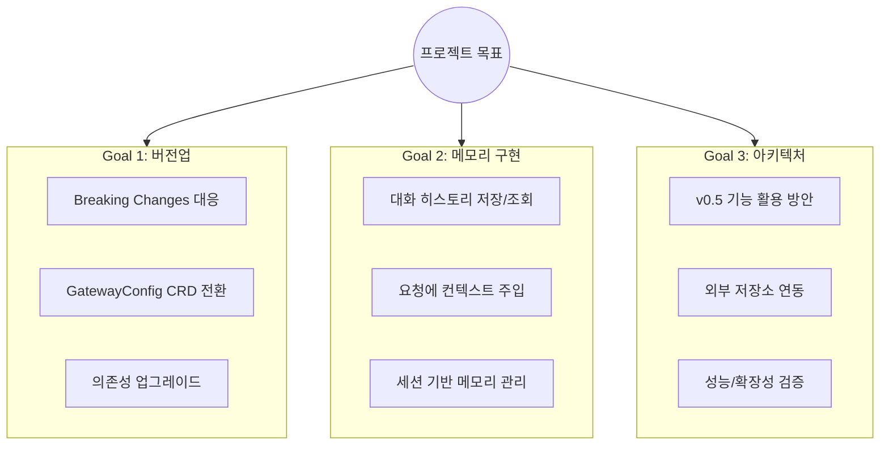

### 2.2 기대 산출물

| 산출물 | 설명 |
|--------|------|
| **마이그레이션 가이드** | v0.4 → v0.5 단계별 전환 절차서 |
| **메모리 PoC 구현체** | ExtProc 기반 대화 메모리 서비스 |
| **아키텍처 설계 문서** | 메모리 시스템 설계 및 구현 가이드 |
| **운영 체크리스트** | 프로덕션 적용 전 확인 사항 |

---

## 3. v0.5 주요 변경사항

### 3.1 메모리 구현에 활용 가능한 기능

| 기능 | 설명 | 활용 |
|------|------|------|
| **Body Mutation** `NEW` | 요청 본문 JSON 필드 추가/제거 | 대화 히스토리 주입 |
| **Header Mutation** `NEW` | 요청 헤더 추가/수정 | 세션 ID 전달 |
| **GatewayConfig** `NEW` | External Processor 환경변수 설정 | 메모리 저장소 연결 |
| **External Processor** | 커스텀 gRPC 서비스 연동 | 메모리 로직 구현 |

### 3.2 Body Mutation 상세

```yaml
# 요청 본문에 필드 추가/수정
bodyMutation:
  set:
    - path: "service_tier"
      value: '"scale"'
    - path: "max_tokens"
      value: "4096"
    - path: "messages"      # 배열도 가능!
      value: '[{"role":"user","content":"hello"}]'
  remove:
    - "internal_flag"
```

> ⚠️ **제한사항**
> - **Top-level 필드만** 지원
> - 중첩 경로 미지원 (예: `messages[0].content` 불가)
> - 최대 16개 필드

> 💡 `messages` 필드 전체를 교체하는 방식으로 대화 히스토리 주입 가능!

### 3.3 Breaking Changes

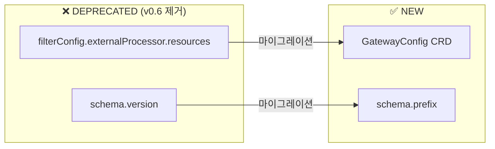

**AS-IS (v0.4)**
```yaml
spec:
  filterConfig:
    externalProcessor:
      resources:  # ← DEPRECATED
        limits:
          memory: "512Mi"

schema:
  version: "/v1beta/openai"  # ← DEPRECATED
```

**TO-BE (v0.5)**
```yaml
apiVersion: aigateway.envoyproxy.io/v1beta1
kind: GatewayConfig
spec:
  extProc:
    kubernetes:
      resources:
        limits:
          memory: "512Mi"

schema:
  prefix: "/v1beta/openai"  # ← NEW
```

### 3.4 의존성 요구사항

| 컴포넌트 | v0.4 | v0.5 | 변경 |
|----------|------|------|------|
| Kubernetes | v1.30+ | **v1.32+** | 업그레이드 필요 |
| Envoy Gateway | v1.5.x | **v1.6.x** | 업그레이드 필요 |
| Envoy Proxy | v1.34.x | **v1.36.4** | 업그레이드 필요 |
| Gateway API | v1.3.x | **v1.4.0** | 업그레이드 필요 |

---

## 4. LLM 대화 메모리 이해하기

### 4.1 LLM의 Stateless 특성

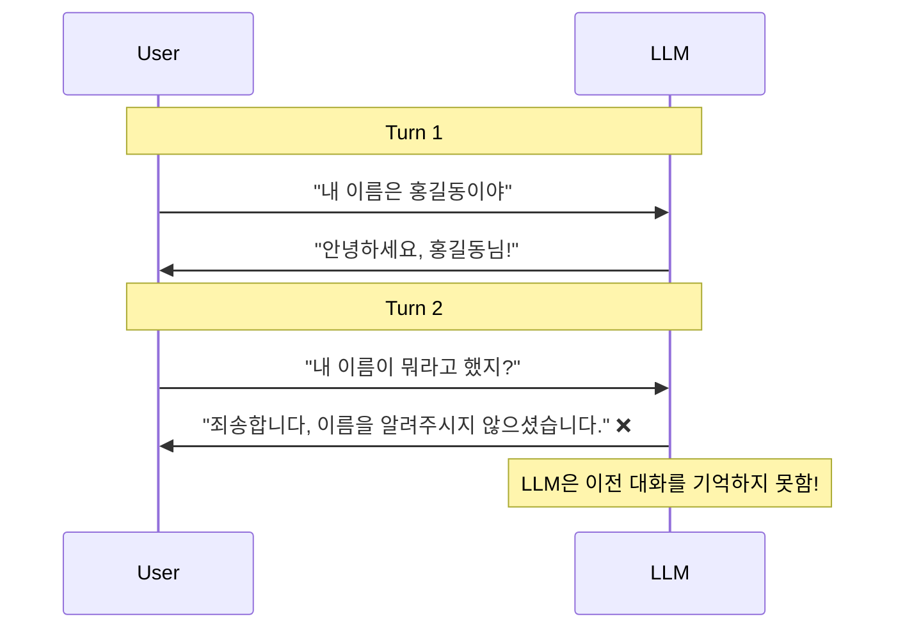

> **LLM API는 매 요청이 독립적** → "매번 처음 만나는 것처럼" 동작

### 4.2 해결 방법: 대화 히스토리 주입

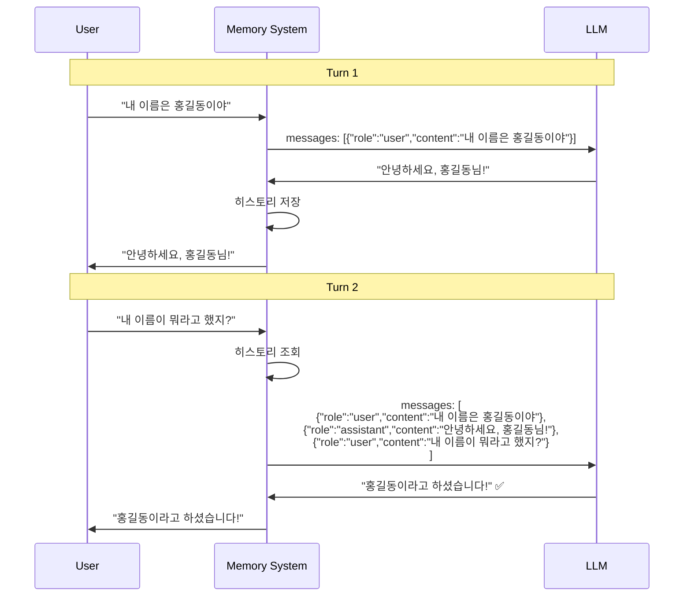

### 4.3 메모리 시스템 아키텍처

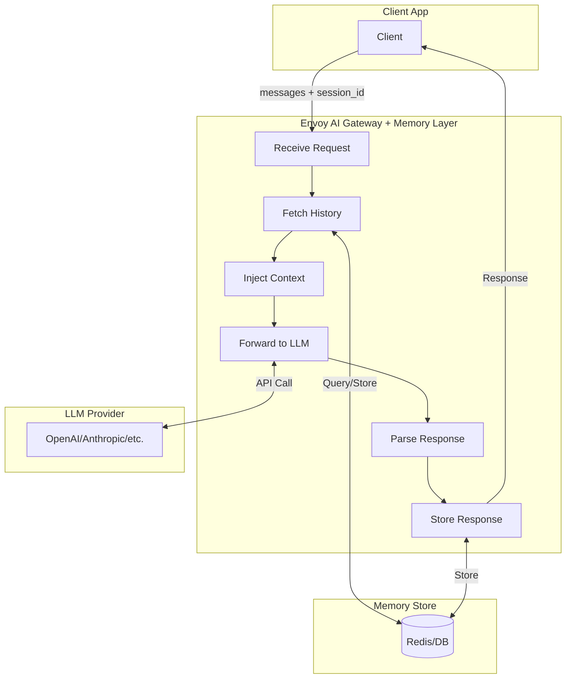

### 4.4 메모리 유형

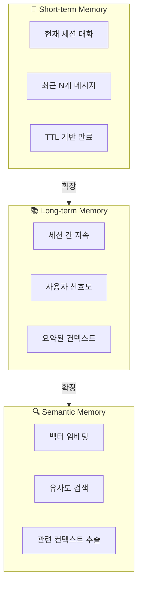

| 유형 | 설명 | 저장소 예시 |
|------|------|-------------|
| **Short-term** | 현재 세션의 최근 대화 | Redis, In-Memory |
| **Long-term** | 세션 간 지속되는 정보 | PostgreSQL, MongoDB |
| **Semantic** | 의미 기반 검색 가능한 메모리 | Redis Vector, Pinecone |

> 💡 **PoC 권장:** Short-term Memory부터 시작 → 점진적 확장

---

## 5. 메모리 구현 접근 방법

### 5.1 접근 방법 비교

| 구분 | Option A: Custom ExtProc | Option B: Body Mutation + 외부 서비스 |
|------|--------------------------|--------------------------------------|
| **구현 방식** | 별도 gRPC 서비스 개발 | AI Gateway 기능만 활용 |
| **유연성** | 완전한 유연성 | 설정 기반 - 코드 최소화 |
| **JSON 조작** | 중첩 JSON 조작 가능 | Top-level만 지원 |
| **저장소 연동** | 외부 저장소 연동 자유 | 별도 Memory Service 필요 |

#### Option A: Custom External Processor

| 장점 | 단점 |
|------|------|
| ✅ 완전한 유연성 - 복잡한 메모리 로직 가능 | ⚠️ 개발 복잡도 높음 |
| ✅ 중첩 JSON 조작 가능 (messages 배열 내부) | |
| ✅ 외부 저장소 연동 자유로움 | |

#### Option B: Body Mutation + 외부 서비스

| 장점 | 단점 |
|------|------|
| ✅ AI Gateway 기능만 활용 | ⚠️ Top-level만 지원 → messages 전체 교체 필요 |
| ✅ 설정 기반 (코드 최소화) | ⚠️ 히스토리 조회를 위한 별도 서비스 필요 |

### 5.2 Option A: Custom ExtProc 아키텍처

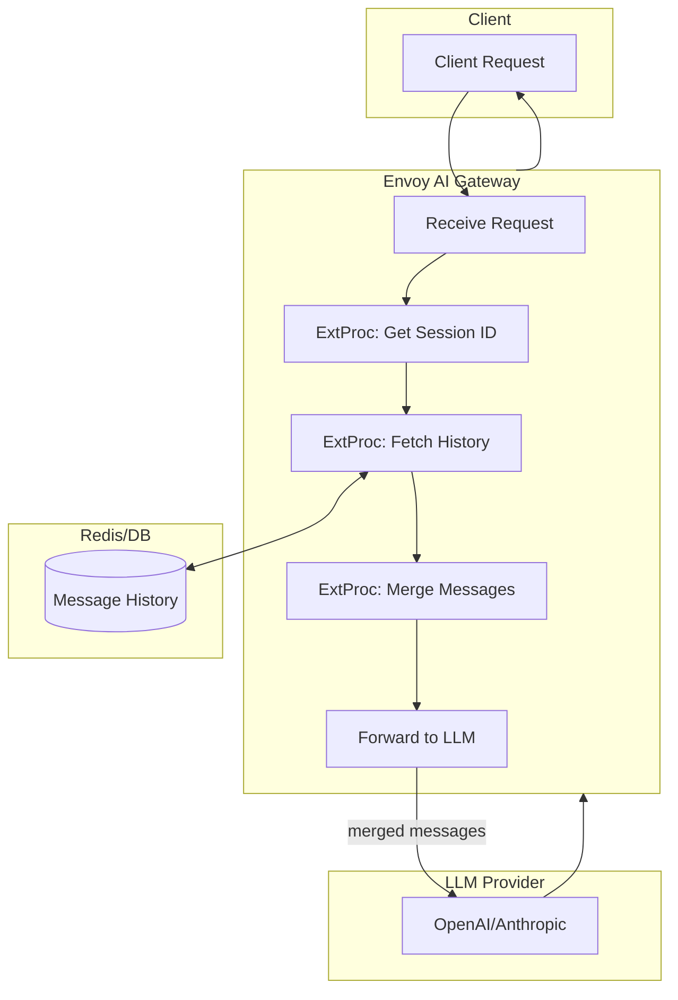

**요청 흐름:**
1. Client가 `x-session-id` 헤더와 함께 요청
2. ExtProc가 세션 ID 추출
3. Redis에서 대화 히스토리 조회
4. 현재 메시지와 히스토리 병합
5. LLM에 전체 컨텍스트 전달

### 5.3 Option A 기반 PoC 아키텍처 예시

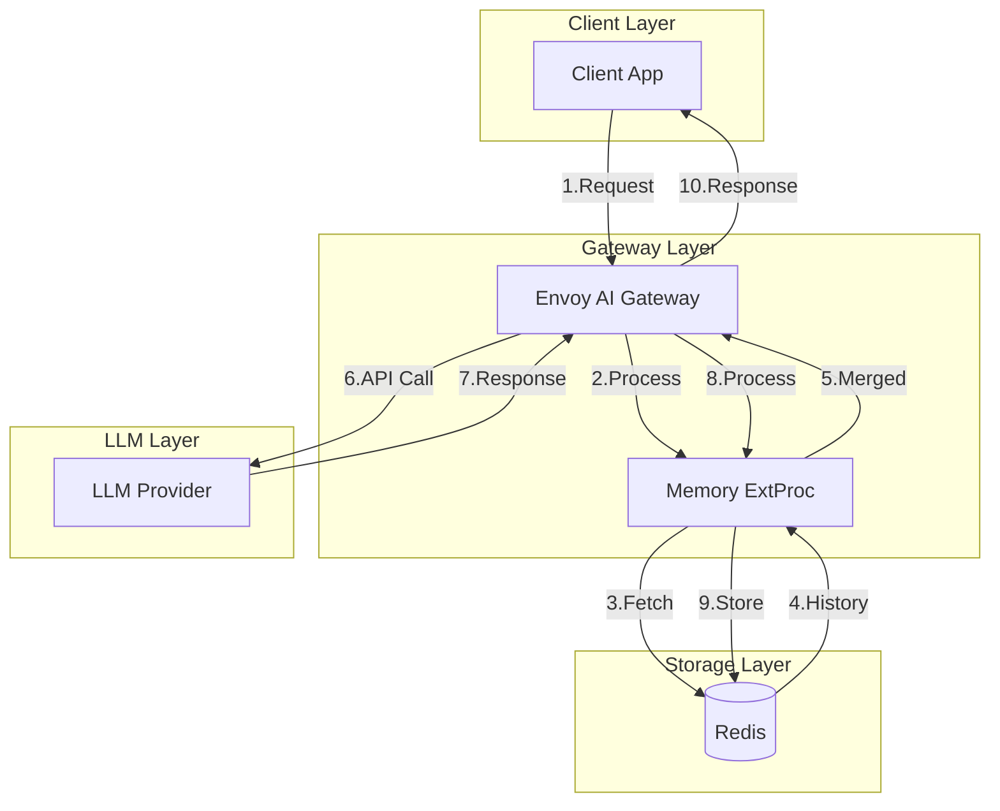

**ExtProc 처리 흐름:**

| 단계 | ProcessingRequest | ProcessingResponse |
|------|-------------------|-------------------|
| 1 | 헤더에서 session_id 추출 | LLM 응답에서 assistant 메시지 추출 |
| 2 | Redis에서 히스토리 조회 | Redis에 새 메시지 저장 |
| 3 | 현재 메시지와 병합 | |
| 4 | 수정된 body 반환 | |

### 5.4 Option B 기반 PoC 아키텍처 예시

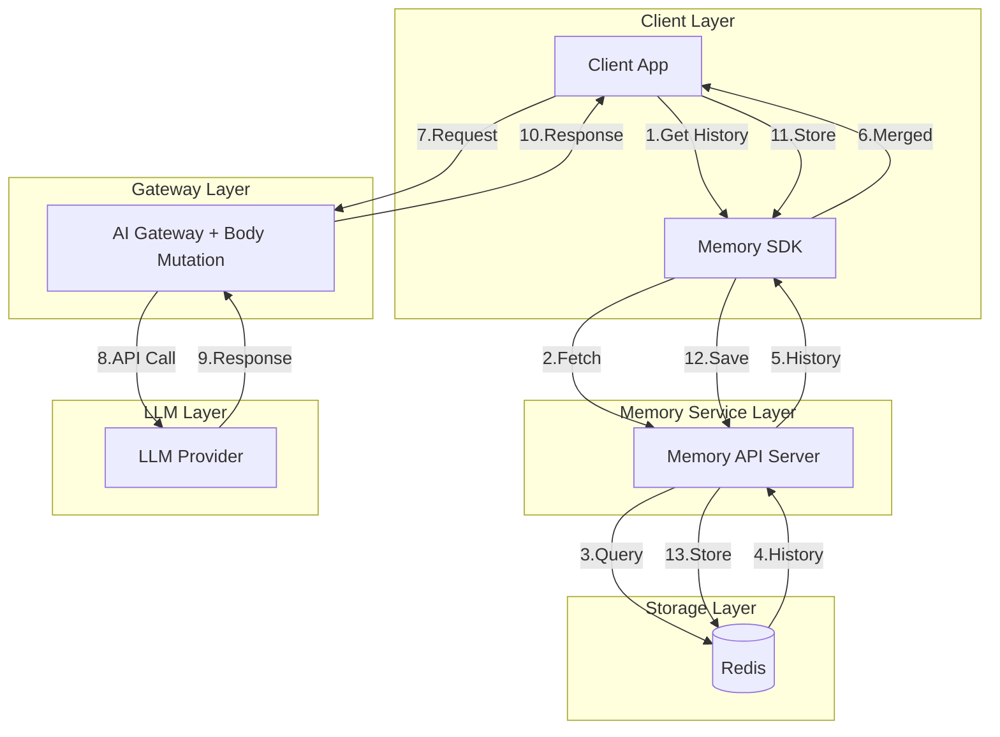

**처리 흐름:**

| 단계 | 설명 |
|------|------|
| 1-5 | 클라이언트가 Memory Service에서 히스토리 조회 |
| 6-7 | 클라이언트가 전체 messages 포함하여 Gateway 호출 |
| 8 | Gateway에서 Body Mutation으로 메타데이터 추가 |
| 9-11 | LLM 호출 및 응답 |
| 12-14 | 클라이언트가 새 메시지를 Memory Service에 저장 |

### 5.5 기술 스택 비교

| 컴포넌트 | Option A | Option B |
|----------|----------|----------|
| **메모리 로직 위치** | ExtProc (Gateway 내부) | Memory Service (외부) |
| **클라이언트 복잡도** | 낮음 (session_id만 전달) | 높음 (히스토리 관리 필요) |
| **개발 언어** | Go / Python (ExtProc SDK) | 자유 (REST API) |
| **Message Store** | Redis | Redis |
| **Session ID 전달** | HTTP Header | HTTP Header 또는 Body |

**공통 기술 스택:**

| 컴포넌트 | 기술 | 이유 |
|----------|------|------|
| **Message Store** | Redis | 빠른 R/W, TTL 지원, K8s 쉬운 배포 |
| **직렬화** | JSON | OpenAI 호환 메시지 포맷 |
| **Session ID** | HTTP Header | `x-session-id` 헤더로 전달 |

> 💡 **확장 옵션:** 나중에 Redis Vector Search로 Semantic Memory 확장 가능

---

## 6. 진행 방식 및 일정 (2주)

### 6.1 2주 일정 개요

> **4명 / 2주 (10 working days)** 기준 현실적인 범위로 조정

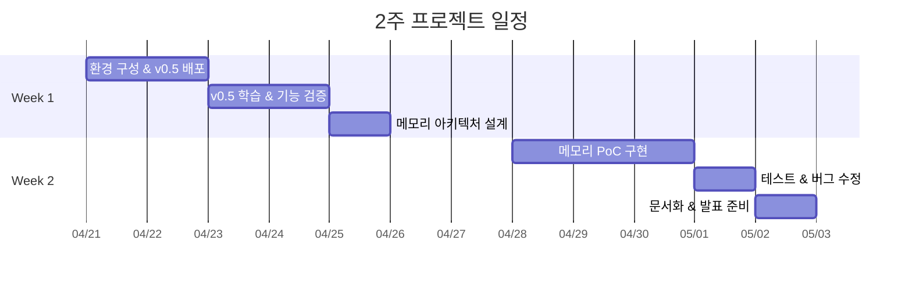

### 6.2 2주 범위 조정

| 구분 | 항목 | 2주 내 가능 여부 |
|------|------|------------------|
| **Core** | v0.5 환경 구성 및 배포 | ✅ 포함 |
| **Core** | v0.5 신규 기능 학습 및 검증 | ✅ 포함 |
| **Core** | 메모리 PoC (Option A 또는 B 중 택1) | ✅ 포함 |
| **Core** | 기본 기능 테스트 | ✅ 포함 |
| **Core** | 마이그레이션 가이드 초안 | ✅ 포함 |
| **Defer** | 성능 벤치마크 | ⏸️ 후속 과제 |
| **Defer** | Long-term / Semantic Memory | ⏸️ 후속 과제 |
| **Defer** | 프로덕션 배포 가이드 | ⏸️ 후속 과제 |

### 6.3 일자별 상세 일정

#### Week 1: 환경 구성 & 학습

| 일차 | 날짜 | 목표 | 산출물 |
|------|------|------|--------|
| **Day 1-2** | 월-화 | 환경 구성 | K8s 클러스터 + v0.5 + Redis 배포 완료 |
| **Day 3-4** | 수-목 | v0.5 학습 | GatewayConfig, Body Mutation 검증 완료 |
| **Day 5** | 금 | 설계 | 메모리 아키텍처 결정 (Option A or B) |

#### Week 2: 구현 & 마무리

| 일차          | 날짜  | 목표     | 산출물             |
| ----------- | --- | ------ | --------------- |
| **Day 6-8** | 월-수 | PoC 구현 | 메모리 기능 동작하는 MVP |
| **Day 9**   | 목   | 테스트    | 기본 시나리오 테스트 통과  |
| **Day 10**  | 금   | 마무리    | 문서 + 발표 자료      |

### 6.4 마일스톤

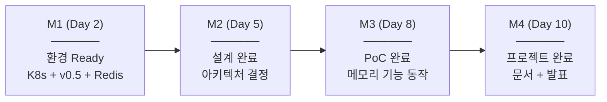

### 6.5 리스크 및 대응

| 리스크 | 영향 | 대응 방안 |
|--------|------|-----------|
| 환경 구성 지연 | 전체 일정 지연 | 사전에 Kind/Helm 설치 확인 |
| ExtProc 개발 난이도 | PoC 미완성 | Option B로 전환 (설정 기반) |
| v0.5 버그/이슈 | 기능 검증 실패 | GitHub Issues 확인, 커뮤니티 질문 |

---

## 7. 수행 방향성 및 접근 방법

### 7.1 Step 1: 환경 구성

```bash
# Kind 클러스터 생성 (K8s 1.32+)
kind create cluster --name ai-gateway-poc --image kindest/node:v1.32.0

# Envoy Gateway v1.6 설치
helm install eg oci://docker.io/envoyproxy/gateway-helm \
  --version v1.6.0 -n envoy-gateway-system --create-namespace

# AI Gateway v0.5 설치
helm install aieg oci://docker.io/envoyproxy/ai-gateway-helm \
  --version v0.5.0 -n ai-gateway-system --create-namespace

# Redis 설치
helm install redis bitnami/redis -n ai-gateway-system
```

### 7.2 Step 2: GatewayConfig 설정

```yaml
apiVersion: aigateway.envoyproxy.io/v1beta1
kind: GatewayConfig
metadata:
  name: memory-enabled-config
spec:
  extProc:
    kubernetes:
      resources:
        requests:
          cpu: "100m"
          memory: "128Mi"
        limits:
          cpu: "500m"
          memory: "512Mi"
      env:
        - name: REDIS_URL
          value: "redis://redis-master:6379"
        - name: MEMORY_TTL_SECONDS
          value: "3600"
        - name: MAX_HISTORY_LENGTH
          value: "20"
---
apiVersion: gateway.networking.k8s.io/v1
kind: Gateway
metadata:
  name: ai-gateway
  annotations:
    aigateway.envoyproxy.io/gateway-config: memory-enabled-config
spec:
  gatewayClassName: eg
  listeners:
    - name: http
      protocol: HTTP
      port: 80
```

### 7.3 Step 3: Memory ExtProc 개발 (Go 예시)

```go
func (s *MemoryProcessor) Process(ctx context.Context,
    req *extproc.ProcessingRequest) (*extproc.ProcessingResponse, error) {

    // 1. 세션 ID 추출
    sessionID := getHeader(req, "x-session-id")

    // 2. Redis에서 히스토리 조회
    history, _ := s.redis.Get(ctx, "chat:"+sessionID).Result()

    // 3. 현재 메시지와 병합
    currentMsgs := parseMessages(req.GetBody())
    allMessages := append(parseHistory(history), currentMsgs...)

    // 4. 수정된 body 반환
    return &extproc.ProcessingResponse{
        Response: &extproc.ProcessingResponse_RequestBody{
            RequestBody: &extproc.BodyResponse{
                Response: &extproc.CommonResponse{
                    BodyMutation: &extproc.BodyMutation{
                        Mutation: &extproc.BodyMutation_Body{
                            Body: buildNewBody(allMessages),
                        },
                    },
                },
            },
        },
    }, nil
}
```

### 7.4 Step 4: 테스트 시나리오

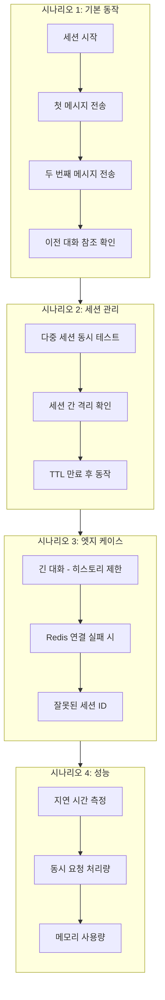

---

## 8. 참고 자료

### 8.1 필수 참고 자료

#### Envoy AI Gateway
- [공식 사이트](https://aigateway.envoyproxy.io/)
- [v0.5 Release Notes](https://aigateway.envoyproxy.io/release-notes/v0.5/)
- [Body Mutation 문서](https://aigateway.envoyproxy.io/docs/capabilities/traffic/header-body-mutations/)
- [GatewayConfig 문서](https://aigateway.envoyproxy.io/docs/0.5/capabilities/gateway-config/)

#### Envoy ExtProc
- [ExtProc Proto 스펙](https://www.envoyproxy.io/docs/envoy/latest/api-v3/service/ext_proc/v3/external_processor.proto)
- [ExtProc 가이드](https://gateway.envoyproxy.io/docs/tasks/extensibility/ext-proc/)

#### LLM Memory
- [Redis Session Memory](https://redis.io/docs/latest/develop/ai/redisvl/user_guide/session_manager/)
- [LangChain Memory 패턴](https://www.pinecone.io/learn/series/langchain/langchain-conversational-memory/)
- [AI Gateway Deep Dive](https://jimmysong.io/blog/ai-gateway-in-depth/)

#### GitHub
- [envoyproxy/ai-gateway](https://github.com/envoyproxy/ai-gateway)
- [envoyproxy/gateway](https://github.com/envoyproxy/gateway)

### 8.2 선택 참고 (MCP 메모리)

> **[Option]** MCP 세션 메모리가 필요한 경우:

- [MCP Gateway 문서](https://aigateway.envoyproxy.io/docs/capabilities/mcp/)
- [MCP Traffic Routing Deep Dive](https://aigateway.envoyproxy.io/blog/mcp-in-envoy-ai-gateway/)

---

## 핵심 정리

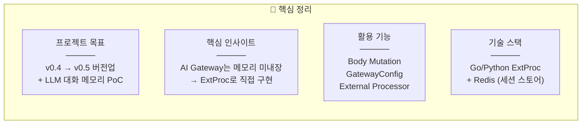

| 항목 | 내용 |
|------|------|
| **프로젝트 목표** | v0.4 → v0.5 버전업 + LLM 대화 메모리 PoC |
| **핵심 인사이트** | AI Gateway는 메모리 미내장 → ExtProc로 직접 구현 |
| **활용 기능** | Body Mutation, GatewayConfig, External Processor |
| **기술 스택** | Go/Python ExtProc + Redis (세션 스토어) |

---

## Q&A

질문이나 논의 사항이 있으시면 말씀해 주세요!


> **Envoy AI Gateway v0.4 → v0.5 버전업 + LLM 대화 메모리 구현**
>
> 킥오프 미팅 | 2026.04.21

## 관련 메모
- [[Envoy AI Gateway 0.5 메모리 프로젝트 학습 노트]] - 프로젝트 학습 정리 노트
- [[DAY3 RAG & Agentic RAG, Memory Management & Reflexion]] - 메모리 관리 설계와 연결
- [[DAY2 Tool Calling Fundamentals & MCP]] - 확장 프로토콜/게이트웨이 관점
## 분류 태그
#type/project-note #area/projects #topic/envoy #topic/gateway #topic/memory #topic/infra
