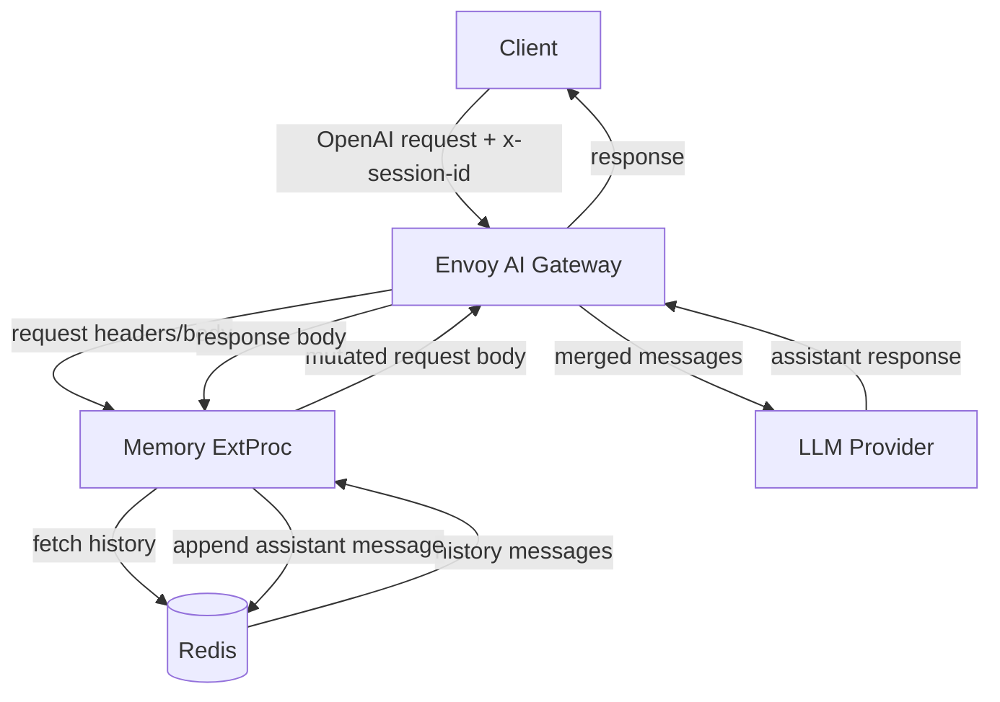

# Memory ExtProc Architecture

이 문서는 Envoy AI Gateway v0.5 기반 LLM 대화 메모리 PoC의 1차 구현 명세입니다.
기준 방향은 `README.md`의 **Option A: Custom External Processor**입니다.

## 목표

- Envoy AI Gateway v0.5의 External Processor 확장 지점에 Memory ExtProc를 연결합니다.
- 클라이언트는 `x-session-id` 헤더와 OpenAI 호환 요청 본문을 전달합니다.
- Memory ExtProc는 세션별 Redis 히스토리를 조회해 현재 `messages` 배열 앞에 병합합니다.
- LLM 응답 이후 assistant 메시지를 추출해 같은 세션 히스토리에 저장합니다.
- 1차 PoC는 Short-term Memory만 다루며 Long-term/Semantic Memory는 후속 확장으로 둡니다.

## 범위

### 포함

- OpenAI 호환 `messages` 배열 처리
- `x-session-id` 기반 세션 분리
- Redis 기반 히스토리 저장/조회
- TTL 기반 세션 만료
- 최대 히스토리 길이 제한
- 요청 본문 mutation
- 응답 본문에서 assistant 메시지 추출 및 저장
- 로컬 단위 테스트와 Kubernetes 배포 예제의 기준 명세

### 제외

- 프로덕션 수준 인증/인가
- 멀티 테넌트 정책
- 장기 메모리 저장소
- Semantic Memory와 벡터 검색
- 성능 벤치마크 자동화
- Provider별 비 OpenAI 포맷 변환

## 컴포넌트



## 요청 흐름

1. 클라이언트가 `x-session-id` 헤더와 OpenAI 호환 요청 본문을 보냅니다.
2. Envoy AI Gateway가 request headers/body를 Memory ExtProc로 전달합니다.
3. Memory ExtProc가 `x-session-id`를 추출합니다.
4. 세션 ID가 유효하면 Redis에서 히스토리를 조회합니다.
5. 요청 본문의 `messages` 배열을 구조체로 파싱합니다.
6. `history + current messages` 순서로 병합합니다.
7. 최대 히스토리 길이를 초과하면 오래된 메시지를 앞에서부터 제거합니다.
8. 병합된 `messages`를 포함한 새 요청 본문을 Gateway에 반환합니다.
9. Gateway가 수정된 요청을 LLM Provider로 전달합니다.

## 응답 흐름

1. LLM Provider가 assistant 응답을 반환합니다.
2. Envoy AI Gateway가 response body를 Memory ExtProc로 전달합니다.
3. Memory ExtProc가 OpenAI 호환 응답에서 assistant 메시지를 추출합니다.
4. assistant 메시지를 Redis 세션 히스토리에 append합니다.
5. TTL을 갱신합니다.
6. assistant 메시지를 추출할 수 없으면 저장을 건너뛰고 경고 로그만 남깁니다.

## 메시지 모델

1차 PoC는 OpenAI Chat Completions 호환 형식을 기준으로 합니다.

```json
{
  "messages": [
    {
      "role": "user",
      "content": "hello"
    }
  ]
}
```

지원 role:

- `system`
- `user`
- `assistant`
- `tool`

초기 구현에서는 `content`를 문자열 또는 JSON 값으로 보존할 수 있게 설계합니다.
단, 히스토리 병합과 저장의 최소 단위는 `role`, `content`를 가진 message object입니다.

## Redis 저장 모델

### Key

```text
memory:session:{session_id}:messages
```

예:

```text
memory:session:demo-001:messages
```

### Value

Redis List를 기본으로 사용합니다.

- append: `RPUSH`
- trim: `LTRIM`
- read: `LRANGE`
- ttl: `EXPIRE`

각 list item은 message JSON 한 개입니다.

```json
{"role":"user","content":"내 이름은 홍길동이야"}
```

### TTL

- 기본값: `3600` seconds
- 환경변수: `MEMORY_TTL_SECONDS`
- 요청 또는 응답 저장 시 세션 key TTL을 갱신합니다.

### 최대 히스토리 길이

- 기본값: `20`
- 환경변수: `MAX_HISTORY_LENGTH`
- Redis에는 최근 N개 메시지만 유지합니다.
- 요청 병합 시에도 최근 N개 이하만 주입합니다.

## 환경변수

| 이름 | 기본값 | 설명 |
|------|--------|------|
| `LISTEN_ADDR` | `:50051` | ExtProc gRPC 서버 listen 주소 |
| `REDIS_URL` | `redis://localhost:6379` | Redis 연결 URL |
| `MEMORY_TTL_SECONDS` | `3600` | 세션 히스토리 TTL |
| `MAX_HISTORY_LENGTH` | `20` | 세션별 최대 저장 메시지 수 |
| `SESSION_HEADER` | `x-session-id` | 세션 식별 헤더 |
| `REDIS_FAILURE_POLICY` | `fail-open` | Redis 장애 시 처리 정책 |
| `MISSING_SESSION_POLICY` | `pass-through` | 세션 ID 누락 시 처리 정책 |

## 실패 정책

### 세션 ID 누락

기본 정책은 `pass-through`입니다.

- 요청을 차단하지 않습니다.
- 히스토리 조회와 저장을 건너뜁니다.
- 원본 요청/응답 흐름을 유지합니다.
- 경고 로그를 남깁니다.

PoC 검증에서 세션 필수 정책이 필요하면 `MISSING_SESSION_POLICY=reject`를 후속으로 추가합니다.

### Redis 연결 실패

기본 정책은 `fail-open`입니다.

- LLM 요청 자체는 통과시킵니다.
- 히스토리 주입과 저장을 건너뜁니다.
- 장애 여부를 로그로 확인할 수 있게 합니다.

이 선택은 메모리 기능보다 LLM 요청 가용성을 우선하기 위한 PoC 기본값입니다.

### 잘못된 요청 JSON

- 요청 본문이 JSON이 아니면 mutation하지 않고 통과시킵니다.
- `messages` 필드가 없거나 배열이 아니면 mutation하지 않고 통과시킵니다.
- 보안상 요청/응답 전문은 로그에 남기지 않습니다.

### assistant 메시지 추출 실패

- 응답 저장을 건너뜁니다.
- 사용자 응답은 그대로 통과시킵니다.
- 실패 원인과 session ID 존재 여부만 로그에 남깁니다.

## Body Mutation 전략

Envoy AI Gateway v0.5의 Body Mutation은 top-level 필드 중심으로 동작한다는 제약을 전제로 합니다.
이 PoC는 `messages` 배열 내부 일부를 수정하는 대신, ExtProc에서 전체 요청 body를 재구성하는 방식을 사용합니다.

요청 본문 mutation 기준:

- 원본 JSON object의 다른 top-level 필드는 보존합니다.
- `messages` 필드만 병합된 배열로 교체합니다.
- 알 수 없는 필드는 삭제하지 않습니다.

## 테스트 시나리오

### 기본 시나리오

- 같은 `x-session-id`에서 두 번째 요청에 첫 번째 대화가 주입됩니다.
- 서로 다른 `x-session-id`의 히스토리는 섞이지 않습니다.
- `MAX_HISTORY_LENGTH`를 넘으면 오래된 메시지가 제거됩니다.
- TTL 만료 후 이전 히스토리는 주입되지 않습니다.

### 장애 시나리오

- `x-session-id` 누락 시 pass-through 됩니다.
- Redis 장애 시 fail-open으로 원본 요청이 통과됩니다.
- 잘못된 JSON 요청은 mutation 없이 통과됩니다.
- assistant 메시지를 추출할 수 없는 응답은 저장하지 않습니다.

## 배포 방향

로컬 검증과 Kubernetes 검증을 분리합니다.

### 로컬

- Redis만 로컬 또는 컨테이너로 실행합니다.
- Memory ExtProc를 로컬 gRPC 서버로 실행합니다.
- 단위 테스트는 Redis 없이 memory/openai 로직부터 검증합니다.

### Kubernetes

- Kind 클러스터를 사용합니다.
- Envoy Gateway v1.6.x를 설치합니다.
- Envoy AI Gateway v0.5를 설치합니다.
- Redis와 Memory ExtProc를 같은 namespace에 배포합니다.
- GatewayConfig 기반으로 ExtProc 설정과 환경변수를 주입합니다.

## 참고 자료

- [Envoy AI Gateway](https://aigateway.envoyproxy.io/)
- [Envoy AI Gateway v0.5 Release Notes](https://aigateway.envoyproxy.io/release-notes/v0.5/)
- [Header and Body Mutations](https://aigateway.envoyproxy.io/docs/capabilities/traffic/header-body-mutations/)
- [GatewayConfig](https://aigateway.envoyproxy.io/docs/0.5/capabilities/gateway-config/)
- [Envoy External Processor proto](https://www.envoyproxy.io/docs/envoy/latest/api-v3/service/ext_proc/v3/external_processor.proto)
- [Envoy Gateway External Processing](https://gateway.envoyproxy.io/docs/tasks/extensibility/ext-proc/)

## 남은 결정 사항

- 실제 response processing mode 설정 세부값
- GatewayConfig에서 Memory ExtProc 서비스를 연결하는 최종 manifest 형태
- user 메시지를 응답 저장 시점에 함께 저장할지, 요청 mutation 시점에 저장할지 여부
- OpenAI streaming 응답을 1차 PoC에서 제외할지 여부
